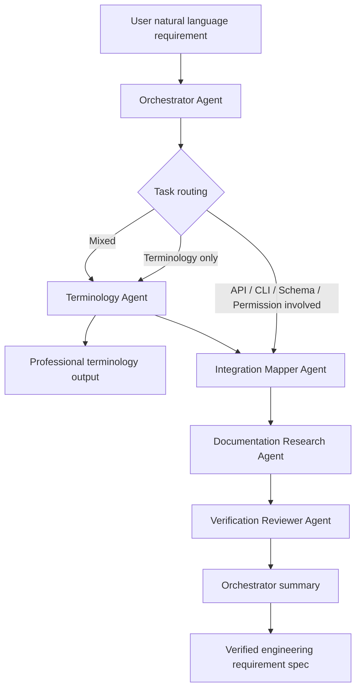

# Requirement-to-System Mapper

**Requirement-to-System Mapper** is a conversational multi-agent system that helps users translate natural language requirements into professional, verifiable, and implementation-ready engineering specifications.

It is designed for AI Coding, product prototyping, and system integration scenarios where users know what they want to build but may not know how to express it in engineering language or how to verify external API capabilities.

> Core method: **say it clearly -> map the system -> check evidence -> review risks -> produce an engineering spec**.

---

## Why this project exists

AI Coding tools can generate code quickly, but they often make assumptions about APIs, fields, permissions, schemas, tokens, and external platform capabilities.

This project focuses on the step before code generation:

- translating vague user needs into professional engineering language;
- identifying whether a need involves external systems;
- mapping business actions to systems, data flow, fields, APIs, CLI capabilities, and permissions;
- checking official documentation before making claims;
- separating verified facts from assumptions and pending items.

The goal is to reduce "AI assumption errors" before an AI Coding tool starts implementation.

---

## Current scope

The MVP currently focuses on three external capability domains:

1. Feishu / Lark Open Platform API
2. WeChat Official Account API
3. Feishu CLI / lark-cli / @larksuite/cli

Out of scope for the current MVP:

- generic third-party SaaS integrations;
- GitHub API, Supabase API, Notion API, DingTalk API, Enterprise WeChat API;
- production API execution;
- automatic publishing, deleting, payment, mass messaging, or batch production writes.

---

## Agent architecture

Requirement-to-System Mapper uses **1 orchestrator agent + 4 specialist agents**.



### Agents

| Agent | Responsibility |
|---|---|
| Orchestrator Agent | Routes tasks, controls workflow, summarizes final output. |
| Terminology Agent | Converts user language into professional product, frontend, backend, API, database, and permission terms. |
| Integration Mapper Agent | Maps business needs to systems, data flow, APIs, fields, permissions, tokens, and verification questions. |
| Documentation Research Agent | Searches official documentation within the current scope and extracts evidence. |
| Verification Reviewer Agent | Reviews assumptions against evidence and separates verified facts, assumptions, pending items, and risks. |

---

## Two core workflows

### 1. Lightweight terminology workflow

Used when the user only wants to know how to express a feature professionally.

```text
User requirement
-> Orchestrator Agent
-> Terminology Agent
-> Professional terminology output
```

Example:

> "Some websites have a top area that switches between pages, while others only show the page title. What is the professional term?"

Expected output:

- Tab Navigation / Tab Switching
- Navigation Bar
- Page Header / Header Title
- Differences and recommended AI Coding expression

---

### 2. System validation workflow

Used when the requirement involves APIs, CLI, schemas, fields, permissions, tokens, or external systems.

```text
User requirement
-> Orchestrator Agent
-> Terminology Agent
-> Integration Mapper Agent
-> Documentation Research Agent
-> Verification Reviewer Agent
-> Final engineering spec
```

Example:

> "When a new Feishu Bitable record is created, send title, body, and cover image to the backend, then decide whether to upload it to WeChat Official Account material library."

Expected output:

- professional requirement restatement;
- involved systems;
- data flow;
- possible API / CLI capabilities;
- verification questions;
- official evidence results;
- verified facts, assumptions, pending items, and risks;
- minimum validation steps;
- AI Coding prompt.

---

## Repository structure

```text
Requirement-to-System-Mapper/
├── README.md
├── docs/
│   ├── project-brief.md
│   ├── prd-v0.1.md
│   ├── agent-architecture.md
│   ├── safety-boundaries.md
│   └── examples.md
└── prompts/
    ├── orchestrator-agent.md
    ├── terminology-agent.md
    ├── integration-mapper-agent.md
    ├── documentation-research-agent.md
    └── verification-reviewer-agent.md
```

Future folders may include:

```text
schemas/
examples/
src/
```

---

## Documentation

- [Project Brief](docs/project-brief.md)
- [Product PRD v0.1](docs/prd-v0.1.md)
- [Agent Architecture](docs/agent-architecture.md)
- [Safety Boundaries](docs/safety-boundaries.md)
- [Examples](docs/examples.md)
- [Prompts](prompts/)

---

## Safety boundaries

The MVP does not execute high-risk actions by default, including:

- deleting data;
- payment;
- mass messaging;
- publishing WeChat Official Account articles;
- modifying production configuration;
- batch writing production data;
- exposing or storing sensitive tokens;
- executing unverified production API calls.

Any future testing capability must operate only in test environments and require human confirmation for risky actions.

---

## Roadmap

### v0.1: Prompt-driven MVP

- Create core project documents.
- Define 5 system prompts.
- Run workflow manually or in a no-code agent platform.

### v0.2: Structured outputs

- Add JSON schemas for each agent.
- Make outputs easier to parse and chain.

### v0.3: Project context library

- Add project-specific context, table schemas, README files, and historical examples.

### v0.4: Testing agent

- Add minimum API / CLI validation in test environments.

### v1.0: Engineering product

- Build a maintainable multi-agent system with tracing, guardrails, tool calls, and human-in-the-loop controls.

---

## One-line summary

Requirement-to-System Mapper is a conversational engineering bridge that turns natural language requirements into professional, evidence-aware, and AI-Coding-ready engineering specifications.
