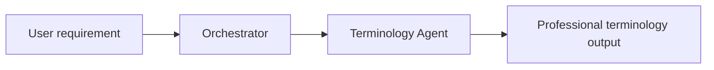
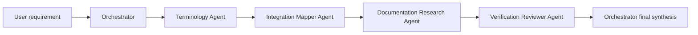

# Agent Architecture

## 1. Overview

Requirement-to-System Mapper is a conversational multi-agent system.

The user only sees a chat-style interface, but behind the interface the system follows a structured workflow:

```text
User requirement
-> Orchestrator routing
-> Specialist agent processing
-> Evidence checking when needed
-> Verification review
-> Final engineering spec
```

The core idea is:

> A simple terminology question should stay lightweight; a system integration question must go through evidence and verification.

---

## 2. Agent list

| Agent | Role | Main output |
|---|---|---|
| Orchestrator Agent | Task routing and final synthesis | Task type, workflow route, final answer |
| Terminology Agent | Professional expression conversion | Terms, definitions, recommended expression |
| Integration Mapper Agent | System and capability mapping | Systems, data flow, possible capabilities, verification questions |
| Documentation Research Agent | Official evidence search | Evidence table, source links, sufficiency assessment |
| Verification Reviewer Agent | Assumption and risk review | Verified facts, assumptions, pending items, risks, minimum validation steps |

---

## 3. Workflow A: Lightweight terminology route

Used when the user only wants to know the professional term for a product, UI, UX, frontend, backend, or data concept.



Typical examples:

- "What is the professional term for a top area that switches pages?"
- "What is the left-side menu called?"
- "What is a pop-up box called?"
- "What is this card-like information block called?"

The system should not call the Documentation Research Agent for this route.

---

## 4. Workflow B: System validation route

Used when the user involves external systems, APIs, CLI, schemas, fields, permissions, tokens, or platform capability verification.



Typical examples:

- "Does Feishu API support getting Bitable field schema?"
- "Can Feishu CLI create Bitable fields?"
- "How should I sync Feishu records to WeChat Official Account drafts?"
- "Which token and permissions are needed for this API action?"

---

## 5. Workflow C: Mixed route

Used when the user asks both for professional terminology and for system integration validation.

```text
Orchestrator
-> Terminology Agent
-> Integration Mapper Agent
-> Documentation Research Agent
-> Verification Reviewer Agent
-> Final synthesis
```

Example:

> I want to build a function that uploads a cover image to WeChat Official Account. What is this called professionally, and does the API really support it?

---

## 6. Routing rules

### terminology_only

Use when the input only concerns:

- product terms;
- UI / UX components;
- frontend components;
- basic backend or data concepts;
- no external system verification.

### integration_validation

Use when the input includes any of the following:

- Feishu;
- WeChat Official Account;
- Feishu CLI;
- API, CLI, SDK;
- Webhook;
- POST, GET, PATCH, DELETE;
- endpoint;
- field, field_id, schema;
- record_id, app_token, table_id;
- access_token, tenant_access_token, user_access_token;
- permission, scope;
- upload, sync, write back, create record, update record;
- official documentation;
- whether a capability is really supported.

### mixed

Use when both terminology explanation and external system validation are needed.

### unclear

Use when there is not enough information. The Orchestrator should provide a safe preliminary interpretation and list the missing information.

---

## 7. Current external capability domains

The Documentation Research Agent is currently limited to:

1. Feishu / Lark Open Platform API
2. WeChat Official Account API
3. Feishu CLI / lark-cli / @larksuite/cli

When a user asks about other systems, the Orchestrator may explain the general concept but must not claim official validation.

---

## 8. Design principle

The agents should follow this chain:

```text
Say it clearly -> Map the system -> Check evidence -> Review assumptions -> Produce the spec
```

This keeps the system from jumping directly from a vague requirement to code generation.
