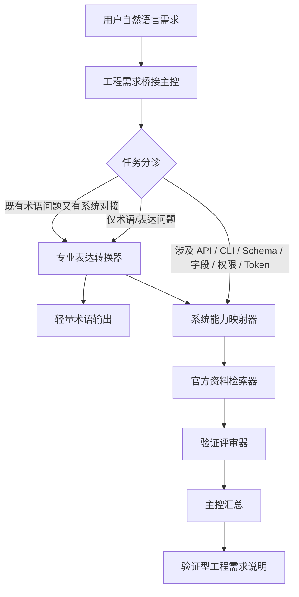

# Requirement-to-System Mapper 产品需求文档 PRD v0.1

## 1. 文档信息

| 项目 | 内容 |
|---|---|
| 产品名称 | Requirement-to-System Mapper |
| 文档类型 | 产品需求文档 PRD |
| 当前版本 | v0.1 |
| 产品阶段 | MVP 规划阶段 |
| 核心目标 | 将用户自然语言需求转化为专业、可验证、可交付的工程需求说明 |
| 当前外部系统范围 | 飞书开放平台 API、微信公众号 API、飞书 CLI / lark-cli / @larksuite/cli |
| 当前不做 | 不支持泛化第三方系统、不直接执行生产环境 API、不自动生成完整生产代码 |

---

## 2. 产品背景

AI Coding 工具降低了代码生成门槛，但在真实开发中，非技术背景用户仍然面临一个关键障碍：

> 用户能描述自己想做什么，但无法把需求准确转化为工程语言；AI 又容易在 API、字段、权限、Schema、Token 等环节想当然。

尤其在系统集成场景中，AI 可能直接生成看似合理的方案，但没有确认：

- 外部系统是否真的开放该能力；
- API 接口版本是否正确；
- 请求方法是否正确；
- 字段名、字段 ID、字段类型是否匹配；
- 当前应用是否具备相应权限；
- token 类型是否适用；
- 返回值是否能作为后续流程连接值；
- 是否存在误触发发布、删除、群发等高风险动作。

Requirement-to-System Mapper 的目标，是在 AI Coding 进入代码生成前，补上一层“需求到工程规范”的桥接层。

---

## 3. 产品目标

Requirement-to-System Mapper 的产品目标是：

> 帮助用户把自然语言需求转化为专业、清晰、可验证、可交付的工程需求说明，并在涉及飞书 API、微信公众号 API、飞书 CLI 时，强制进行资料核验和风险评审。

### 3.1 核心目标

1. 帮助用户把口语化需求转成专业术语；
2. 判断需求是否涉及外部系统对接；
3. 当需求涉及 API、CLI、Schema、字段、权限、Token 时，进入完整验证流程；
4. 限定当前资料检索范围为飞书 API、微信公众号 API、飞书 CLI；
5. 输出已验证事实、合理推测、待确认事项和高风险假设；
6. 生成可交给 AI Coding 工具或开发者使用的工程需求说明。

### 3.2 非目标

当前版本不追求：

1. 不做完整代码生成平台；
2. 不直接执行生产环境 API；
3. 不自动发布微信公众号内容；
4. 不自动删除、支付、群发或修改关键生产数据；
5. 不支持任意第三方系统的泛化集成；
6. 不替代官方文档和真实测试环境；
7. 不把未经验证的信息写成确定结论。

---

## 4. 目标用户

### 4.1 非技术背景 AI Coding 用户

用户特征：

- 能描述自己想做什么；
- 不熟悉前端、后端、数据库、API、权限等专业术语；
- 使用 AI Coding 工具时，常常不知道如何提出准确需求。

典型需求：

- “这个网页顶部切换页面的组件叫什么？”
- “我想做一个表单提交功能，应该怎么专业表达？”
- “我想让两个系统之间传数据，这叫 API 还是 Webhook？”

### 4.2 AI 产品解决方案实践者

用户特征：

- 需要把业务需求转成系统方案；
- 关注流程、字段、数据流、接口和权限；
- 希望 AI 不只是写代码，而是能帮助做系统分析。

典型需求：

- “这个业务流程应该拆成几个接口？”
- “数据从哪里来，流向哪里？”
- “哪个字段应该作为主连接值？”
- “哪些能力应该在前端做，哪些应该在后端做？”

### 4.3 飞书 / 微信公众号自动化集成用户

用户特征：

- 正在做飞书多维表格、微信公众号 API、飞书 CLI 相关集成；
- 需要确认平台能力是否真实存在；
- 需要知道接口、字段、权限、Token、Schema 的正确用法。

典型需求：

- “飞书 API 是否支持创建多维表格记录？”
- “飞书 API 是否支持获取字段结构？”
- “微信公众号 API 是否支持上传封面素材？”
- “飞书 CLI 是否支持我想要的操作？”
- “这个动作需要什么权限和 token？”

---

## 5. 核心使用场景

### 5.1 场景一：用户只想知道专业术语

示例输入：

> 我看到有些网页顶部可以切换不同页面，有些顶部只是显示标题，这个怎么专业表达？

系统判断：该需求只涉及产品 / 前端 / UI 术语，不涉及 API、CLI、Schema、字段、权限、Token。

调用路线：

```text
用户输入 -> 工程需求桥接主控 -> 专业表达转换器 -> 输出专业术语和推荐表达
```

预期输出：

- Tab Navigation / Tab Switching；
- Navigation Bar；
- Page Header / Header Title；
- Tabs 和 Navigation Bar 的区别；
- 推荐给 AI Coding 工具的专业表达。

### 5.2 场景二：用户提出系统对接需求

示例输入：

> 我想让飞书多维表格新增一条记录后，把标题、正文、封面传给后端，后端根据阶段判断是否上传到微信公众号素材库。

系统判断：该需求涉及飞书 API、微信公众号 API、字段映射、record_id、access_token、可能的 Webhook / POST / PATCH 和外部系统能力验证。

调用路线：

```text
用户输入 -> 工程需求桥接主控 -> 专业表达转换器 -> 系统能力映射器 -> 官方资料检索器 -> 验证评审器 -> 工程需求桥接主控汇总 -> 输出验证型工程需求说明
```

预期输出：

- 专业需求表达；
- 涉及系统；
- 数据流；
- 可能涉及的接口；
- 必须验证的问题；
- 官方资料核验结果；
- 已验证事实；
- 待确认事项；
- 高风险假设；
- 最小验证动作；
- 可交给 AI Coding 工具的开发提示词。

### 5.3 场景三：用户直接询问某个 API 或 CLI 能力是否存在

示例输入：

> 飞书 CLI 能不能帮我获取多维表格字段结构？

系统判断：该需求涉及飞书 CLI 能力核验，需要进入验证流程。

调用路线：

```text
用户输入 -> 工程需求桥接主控 -> 系统能力映射器 -> 官方资料检索器 -> 验证评审器 -> 输出核验结论
```

---

## 6. 产品架构

Requirement-to-System Mapper 采用：

> 1 个主智能体 + 4 个子智能体



---

## 7. 智能体说明

| 智能体 | 定位 | 核心职责 |
|---|---|---|
| 工程需求桥接主控 | 任务分诊与汇总 | 判断路线、调用子智能体、生成最终输出 |
| 专业表达转换器 | 术语转换 | 将口语化需求转化为专业表达 |
| 系统能力映射器 | 系统分析 | 拆解系统、业务动作、数据流、接口、字段、权限和验证问题 |
| 官方资料检索器 | 证据检索 | 查找飞书 API、微信公众号 API、飞书 CLI 官方资料 |
| 验证评审器 | 风险审查 | 区分已验证事实、合理推测、待确认事项和高风险假设 |

---

## 8. 任务分诊规则

### 8.1 轻量术语路线触发条件

当用户需求满足以下条件时，走轻量术语路线：

- 只涉及页面、组件、布局、交互、产品功能命名；
- 不涉及外部系统；
- 不涉及 API、CLI、SDK；
- 不涉及字段、Schema、权限、Token；
- 不询问“是否真的支持”。

示例触发词：页面顶部、切换页面、左侧菜单、弹窗、表单、卡片、筛选、搜索框、页面标题、专业术语怎么说。

### 8.2 系统验证路线触发条件

只要用户需求出现以下任一类型信息，就进入系统验证路线：

| 触发类型 | 示例 |
|---|---|
| 外部系统 | 飞书、微信公众号、飞书 CLI |
| API 相关 | API、接口、endpoint、POST、GET、PATCH、DELETE |
| 数据结构 | 字段、field_id、schema、record_id、table_id、app_token |
| 权限鉴权 | 权限、scope、token、access_token、tenant_access_token、user_access_token |
| 系统交互 | Webhook、回调、同步、上传、回写 |
| 能力核验 | 是否支持、有没有这个接口、官方文档有没有 |
| 高风险动作 | 发布、删除、群发、支付、批量写入 |

---

## 9. 功能模块清单

| 模块 | 优先级 | 说明 |
|---|---|---|
| 用户需求输入模块 | P0 | 用户输入自然语言需求 |
| 任务分诊模块 | P0 | 判断走轻量术语路线还是系统验证路线 |
| 专业表达转换模块 | P0 | 输出专业术语和推荐表达 |
| 系统能力映射模块 | P0 | 拆解系统、数据流、接口、字段、权限 |
| 官方资料检索模块 | P0 | 限定检索飞书 API、微信公众号 API、飞书 CLI |
| 验证评审模块 | P0 | 输出已验证事实、合理推测、待确认事项和风险 |
| 最终报告生成模块 | P0 | 汇总生成工程需求说明 |
| 一键复制 AI Coding 提示词 | P1 | 将最终方案转成可复制提示词 |
| 历史需求记录模块 | P1 | 保存用户历史需求和输出 |
| 项目上下文库模块 | P1 | 接入用户项目背景、表结构、历史方案 |
| 测试执行模块 | P2 | 未来支持 API / CLI 最小测试 |

---

## 10. MVP 功能需求

### 10.1 需求输入模块

用户可以输入一段自然语言需求，系统根据内容判断处理路线。

验收标准：

- 用户可以输入不少于 10 个中文字符的需求；
- 系统能保留原始输入；
- 系统不会在未分析前直接生成代码。

### 10.2 任务分诊模块

系统判断用户需求属于轻量术语问题，还是系统对接验证问题。

输出：

```json
{
  "task_type": "terminology_only | integration_validation | mixed | unclear",
  "reason": "",
  "next_agents": []
}
```

验收标准：

- 用户只问“顶部切换叫什么”时，输出 `terminology_only`；
- 用户问“飞书 API 是否支持创建记录”时，输出 `integration_validation`；
- 用户既问术语又涉及 API 时，输出 `mixed`；
- 不确定时输出 `unclear`，并提出补充问题或默认给出安全的初步判断。

### 10.3 专业表达转换模块

输出结构：

```json
{
  "original_requirement": "",
  "professional_terms": [
    {
      "term_cn": "",
      "term_en": "",
      "explanation": "",
      "when_to_use": ""
    }
  ],
  "recommended_expression": "",
  "involves_external_system": true
}
```

验收标准：

- 能区分 Tab Navigation、Navigation Bar、Page Header；
- 能说明相近概念差异；
- 能输出适合交给 AI Coding 工具的表达；
- 不在无必要时进入 API 验证链路。

### 10.4 系统能力映射模块

输出结构：

```json
{
  "involved_systems": [],
  "business_actions": [],
  "data_objects": [],
  "data_flow": [],
  "possible_api_or_cli_capabilities": [],
  "possible_fields_or_ids": [],
  "possible_permissions": [],
  "verification_questions": []
}
```

验收标准：

- 对飞书相关需求，能识别 app_token、table_id、record_id、field_id 等可能对象；
- 对微信公众号相关需求，能识别 access_token、media_id、素材、草稿、发布等可能对象；
- 对 CLI 相关需求，能识别需要核验命令支持范围；
- 所有未验证能力必须标注“待验证”。

### 10.5 官方资料检索模块

输出结构：

```json
{
  "evidence_results": [
    {
      "question": "",
      "conclusion": "supported | unsupported | not_found | partially_supported",
      "official_source": "",
      "source_link": "",
      "evidence_summary": "",
      "is_sufficient": true
    }
  ]
}
```

验收标准：

- 必须优先引用官方资料；
- 找不到官方依据时，不得编造；
- 每条结论必须对应来源；
- 资料不足时必须标注 `not_found` 或 `partially_supported`。

### 10.6 验证评审模块

输出结构：

```json
{
  "verified_facts": [],
  "reasonable_assumptions": [],
  "pending_items": [],
  "high_risk_assumptions": [],
  "invalid_assumptions": [],
  "minimum_validation_steps": []
}
```

验收标准：

- 没有证据支持的内容不得进入 `verified_facts`；
- 涉及发布、删除、支付、群发等动作时，必须进入 `high_risk_assumptions`；
- 如果资料不足，必须输出 `pending_items`；
- 必须给出至少一个下一步最小验证动作。

---

## 11. 标准输出格式

### 11.1 轻量术语路线输出格式

```markdown
# 专业术语转换结果

## 1. 你的原始描述
## 2. 更专业的说法
## 3. 涉及术语
## 4. 容易混淆的概念
## 5. 推荐给 AI Coding 工具的表达
```

### 11.2 系统验证路线输出格式

```markdown
# 验证型工程需求说明

## 1. 原始需求复述
## 2. 专业术语转换
## 3. 任务类型判断
## 4. 系统能力映射
## 5. 待验证问题
## 6. 官方资料核验结果
## 7. 验证评审结论
## 8. 字段 / 接口 / 权限映射
## 9. 最小验证动作
## 10. 可交给 AI Coding 的开发提示词
```

---

## 12. 权限与安全边界

当前 MVP 默认不执行以下动作：

- 删除数据；
- 支付；
- 群发；
- 正式发布公众号文章；
- 修改生产环境关键配置；
- 批量写入真实业务数据；
- 暴露或存储用户敏感 token；
- 未经确认调用高风险接口。

---

## 13. 异常场景处理

| 异常场景 | 系统处理方式 |
|---|---|
| 用户需求太模糊 | 输出澄清问题，或给出可能解释 |
| 用户问题超出当前系统范围 | 明确说明当前只支持飞书 API、微信公众号 API、飞书 CLI |
| 官方资料未找到 | 标注“未找到官方依据”，不得编造 |
| 官方资料存在冲突 | 标注冲突点，建议人工确认 |
| 用户要求直接生成代码 | 提醒先完成验证，再生成代码 |
| 用户要求执行高风险动作 | 默认拒绝或要求人工确认 |
| 字段结构未知 | 标注需要获取 Schema |
| 权限未知 | 标注需要查权限 scope 或后台授权配置 |
| token 类型未知 | 标注需要查官方鉴权文档 |
| CLI 能力未知 | 标注需要查官方命令列表或仓库 README |

---

## 14. 验收标准

### 14.1 全局验收标准

1. 系统能区分轻量术语问题和系统验证问题；
2. 系统能在简单问题中避免过度验证；
3. 系统能在复杂问题中强制进入验证流程；
4. 系统不会把未经验证的信息写成事实；
5. 系统输出必须清楚区分已验证事实、合理推测、待确认事项和高风险假设；
6. 系统最终输出能被非技术背景用户理解；
7. 系统最终输出能被 AI Coding 工具或开发者继续使用。

### 14.2 测试用例一：术语转换

输入：

```text
我看到有的网页顶部可以切换不同页面，有的顶部只是起到标题作用，这个怎么专业表达？
```

预期结果：

- task_type = terminology_only；
- 输出 Tab Navigation / Tab Switching；
- 输出 Page Header / Header Title；
- 解释 Navigation Bar、Tabs、Page Header 区别；
- 不调用官方资料检索器；
- 不输出 API 权限验证报告。

### 14.3 测试用例二：飞书 API 能力核验

输入：

```text
我想知道飞书 API 是否支持获取多维表格字段结构。
```

预期结果：

- task_type = integration_validation；
- 调用系统能力映射器；
- 调用官方资料检索器；
- 输出官方资料核验结果；
- 如果资料支持，进入已验证事实；
- 如果资料不足，进入待确认事项；
- 不得凭经验直接断言。

### 14.4 测试用例三：飞书到微信公众号系统对接

输入：

```text
我想让飞书多维表格新增一条文章记录后，把标题、正文、封面传给后端，后端根据阶段判断是否上传到微信公众号素材库。
```

预期结果：

- task_type = mixed 或 integration_validation；
- 识别飞书、后端、微信公众号三个系统；
- 识别标题、正文、封面、阶段、状态、record_id 等对象；
- 输出待验证问题；
- 查飞书 API、微信公众号 API；
- 输出字段、接口、权限、token 相关待确认项；
- 标注上传素材、发布内容等高风险边界；
- 给出最小验证动作。

---

## 15. MVP 版本范围

### 15.1 MVP 必须完成

- 用户自然语言输入；
- 任务分诊；
- 专业表达转换；
- 系统能力映射；
- 官方资料检索；
- 验证评审；
- 最终报告生成；
- 限定三类资料域；
- 输出最小验证动作。

### 15.2 MVP 暂不完成

- 任意第三方系统检索；
- 自动执行生产环境 API；
- 自动生成完整生产代码；
- 自动发布公众号；
- 自动修改真实业务数据；
- 用户账号体系；
- 可视化工作台；
- 历史记录管理；
- 项目上下文库；
- 测试执行智能体。

---

## 16. 后续迭代规划

### v0.1：提示词驱动 MVP

先用主控提示词 + 子智能体提示词跑通流程，不开发复杂前端，不接真实 API 测试，重点验证多智能体协作逻辑。

### v0.2：加入结构化输出

为每个智能体定义 JSON 输出，让主控智能体能稳定读取子智能体结果。

### v0.3：加入项目上下文库

接入用户已有项目资料，支持读取飞书表结构、GitHub README、历史需求文档。

### v0.4：加入测试执行智能体

在测试环境中执行最小 API / CLI 验证，不操作生产数据，不执行高风险动作。

### v1.0：形成完整工程需求桥接系统

支持完整多智能体协作、资料检索、证据核验、最终报告、项目上下文和最小验证测试。

---

## 17. 可交给 AI Coding 工具的开发提示词

```text
请基于本 PRD，为 Requirement-to-System Mapper 开发一个 MVP 原型。

产品目标：帮助用户将自然语言需求转化为专业、可验证、可交付的工程需求说明。

当前 MVP 包含：
1. 用户需求输入模块；
2. 任务分诊模块；
3. 专业表达转换模块；
4. 系统能力映射模块；
5. 官方资料检索模块；
6. 验证评审模块；
7. 最终报告生成模块。

当前外部资料域限定为：
1. 飞书开放平台 API；
2. 微信公众号 API；
3. 飞书 CLI / lark-cli / @larksuite/cli。

核心逻辑：
- 如果用户只问产品、前端、交互术语，则走轻量术语路线；
- 如果用户涉及 API、CLI、Schema、字段、权限、Token、飞书、微信公众号等，则走系统验证路线；
- 所有涉及外部系统能力的结论必须区分已验证事实、合理推测、待确认事项和高风险假设；
- 不允许编造接口、字段、权限、返回值；
- 不直接执行生产环境 API；
- 不自动发布、删除、支付、群发或批量修改真实数据。

请先实现一个本地可运行的 Web 原型：
- 前端提供一个需求输入框；
- 用户提交后，系统展示任务类型判断；
- 如果是 terminology_only，展示专业术语转换结果；
- 如果是 integration_validation 或 mixed，展示系统能力映射、待验证问题、资料核验占位、验证评审占位和最终报告；
- 暂时可以用模拟数据代替真实联网检索，但代码结构要预留官方资料检索模块；
- 所有模块输出采用 JSON schema，最终渲染为 Markdown 报告。

请优先保证代码结构清晰、模块职责单一、便于后续接入真实搜索和 API 测试能力。
```

---

## 18. 一句话总结

Requirement-to-System Mapper 的 PRD v0.1 定义了一个验证优先的多智能体 MVP：它先判断用户需求是简单术语问题还是系统对接问题，再通过专业表达转换、系统能力映射、官方资料检索和验证评审，将自然语言需求转化为可靠的工程需求说明。
