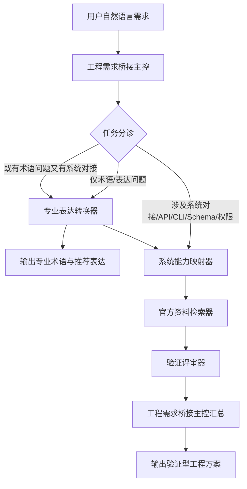

# Requirement-to-System Mapper 项目说明书

## 1. 项目简介

**Requirement-to-System Mapper** 是一个面向非技术背景用户、AI 产品实践者和 AI Coding 使用者的多智能体协作系统。

它的目标不是直接替用户写代码，而是帮助用户完成更前置、更关键的工作：

> 将自然语言需求转化为专业、清晰、可验证、可交付的工程需求说明。

在 AI Coding 场景中，很多用户能够描述自己想要的功能，却难以准确表达：

- 这个页面组件专业上叫什么；
- 这个交互属于哪种前端模式；
- 这个业务动作应该对应什么接口；
- 数据应该从哪里来、流向哪里；
- 字段应该如何映射；
- 外部系统是否真的支持这个能力；
- 调用 API 或 CLI 时需要什么权限；
- 哪些内容是已验证事实，哪些只是 AI 的推测。

Requirement-to-System Mapper 试图解决的核心问题是：

> 让 AI 不只是“会写代码”，而是先学会“把需求说清楚、把系统拆明白、把外部能力查真实、把工程方案做可靠”。

---

## 2. 项目背景

随着 AI Coding 工具的发展，非技术背景用户也可以借助 AI 完成网页、自动化流程、数据系统和轻量级产品的开发。

但在实际开发过程中，一个非常常见的问题是：

> AI 很容易根据用户的口语化需求直接生成看似合理的方案，但它可能没有真正确认 API 是否存在、字段是否正确、权限是否具备、接口版本是否匹配。

这种问题在系统集成场景中尤其明显。

例如：

- 用户说“把飞书多维表格新增记录同步到后端”；
- AI 可能直接假设可以通过某个接口实现；
- 但实际还需要确认：
  - 飞书是否开放对应 API；
  - 接口版本是什么；
  - 请求方法是 POST、GET 还是 PATCH；
  - 字段显示名和字段 ID 如何对应；
  - record_id 是否能作为后续更新的连接值；
  - 当前应用是否拥有读写权限；
  - token 类型是否正确；
  - 是否需要 webhook、自动化流程或轮询机制。

因此，Requirement-to-System Mapper 的设计重点不是“快速生成答案”，而是建立一套验证型工程协作流程：

> 说清楚 -> 拆明白 -> 查证据 -> 做判断 -> 给方案。

---

## 3. 项目定位

Requirement-to-System Mapper 是一个“需求到系统映射”的桥接系统。

它连接三类语言：

| 用户语言 | 工程语言 | 外部系统语言 |
|---|---|---|
| 我想做一个功能 | 组件、接口、字段、数据流、权限 | API、CLI、Schema、Token、Scope |
| 顶部可以切换页面 | Tab Navigation / Navigation Bar | 不涉及外部系统 |
| 飞书新增记录后处理草稿 | Webhook / POST / record_id / PATCH | 飞书 API / 字段元数据 / 权限 |
| 上传封面到公众号 | 素材上传 / 文件上传 / media_id | 微信公众号 API / access_token |

Requirement-to-System Mapper 的核心价值是：

1. 帮用户把模糊需求转成专业表达；
2. 帮系统判断需求是否涉及外部平台能力；
3. 在涉及外部系统时，优先查阅官方资料；
4. 对接口、字段、权限、Schema、Token 进行核验；
5. 最终输出可交给 AI Coding 工具或开发者使用的工程方案。

---

## 4. 当前项目边界

Requirement-to-System Mapper 当前版本聚焦三个外部系统能力域：

1. 飞书开放平台 API
2. 微信公众号 API
3. 飞书 CLI / lark-cli / @larksuite/cli

当前暂不扩展到：

- 企业微信 API；
- 钉钉 API；
- Notion API；
- Airtable API；
- GitHub API；
- Supabase API；
- 通用第三方 SaaS API；
- 任意外部系统的泛化集成。

这样做的原因是：

> MVP 阶段最重要的不是覆盖所有系统，而是先把“需求翻译、外部能力理解、资料检索、验证评审”的协作机制跑通。

---

## 5. 核心用户

### 5.1 非技术背景的 AI Coding 用户

他们知道自己想做什么，但不知道如何用工程语言表达。

典型问题：

- “这个页面顶部切换叫什么？”
- “我想做一个表单提交功能，专业上怎么说？”
- “我想让两个系统之间传数据，这叫 API 还是 Webhook？”
- “我该怎么告诉 AI Coding 工具我要什么？”

### 5.2 AI 产品解决方案实践者

他们需要把业务需求转化为可执行的系统方案。

典型问题：

- “这个业务流程应该拆成几个接口？”
- “数据应该怎么流转？”
- “哪个字段作为主连接值？”
- “哪些能力应该在前端做，哪些在后端做？”

### 5.3 做飞书 / 微信公众号自动化集成的人

他们需要确认外部系统能力是否真实存在。

典型问题：

- “飞书 API 是否支持创建多维表格记录？”
- “飞书 API 是否支持获取字段结构？”
- “微信公众号 API 是否支持上传封面素材？”
- “飞书 CLI 是否支持我想要的操作？”
- “这个动作需要什么权限和 token？”

---

## 6. 核心设计理念

### 6.1 先翻译，再实现

用户的自然语言需求不能直接进入代码阶段。系统需要先判断这是页面组件问题、产品功能问题、数据结构问题、系统对接问题，还是 API / CLI / 权限验证问题。

### 6.2 简单问题轻量处理，复杂问题完整验证

如果用户只是想知道某个功能的专业叫法，系统只需要调用专业表达转换器。如果用户的问题涉及 API、CLI、Schema、字段、权限、Token、外部平台能力，则进入完整链路。

### 6.3 外部系统不能靠想象

当需求涉及飞书、微信公众号或飞书 CLI 时，系统不能直接假设外部能力存在。必须优先确认官方是否开放该能力、使用哪个接口、接口版本、请求方法、字段、权限、返回值和限制条件。

### 6.4 区分事实、推测和待确认事项

| 类型 | 含义 |
|---|---|
| 已验证事实 | 有官方文档、Schema 或实测结果支持 |
| 合理推测 | 基于工程经验，但尚未验证 |
| 待确认事项 | 缺少资料或需要用户提供信息 |
| 高风险假设 | 如果判断错误，可能导致接口失败、权限失败、数据污染或误操作 |

### 6.5 最小验证优先

在进入完整开发前，Requirement-to-System Mapper 会优先建议最小验证动作，例如查官方接口文档、获取字段 Schema、用测试记录验证 POST、用测试 record_id 验证 PATCH、确认 token 类型和权限 scope。

---

## 7. 智能体架构

Requirement-to-System Mapper 采用“1 个主智能体 + 4 个子智能体”的架构。



---

## 8. 智能体角色说明

| 智能体 | 角色定位 |
|---|---|
| 工程需求桥接主控 | 任务分诊者和结果汇总者 |
| 专业表达转换器 | 把用户口语化需求转成专业表达 |
| 系统能力映射器 | 把业务需求拆成系统、接口、字段、权限、数据流和验证问题 |
| 官方资料检索器 | 查飞书 API、微信公众号 API、飞书 CLI 官方资料 |
| 验证评审器 | 对照证据审查假设，防止 AI 想当然 |

---

## 9. 两条核心工作流

### 9.1 轻量术语路线

适用于用户只想知道“这个东西专业上叫什么”。

```text
用户需求 -> 工程需求桥接主控 -> 专业表达转换器 -> 输出专业术语和推荐表达
```

### 9.2 系统验证路线

适用于用户需求涉及外部系统、API、CLI、Schema、字段、权限或 Token。

```text
用户需求 -> 工程需求桥接主控 -> 专业表达转换器 -> 系统能力映射器 -> 官方资料检索器 -> 验证评审器 -> 工程需求桥接主控汇总 -> 输出验证型工程方案
```

---

## 10. 当前支持的典型任务

- 专业术语转换；
- 飞书 API 对接分析；
- 微信公众号 API 对接分析；
- 飞书 CLI 能力核验；
- 字段、Schema、权限、Token 风险识别；
- 可交给 AI Coding 工具的开发提示词生成。

---

## 11. 安全边界

Requirement-to-System Mapper 当前版本默认不执行以下动作：

- 删除数据；
- 支付；
- 群发；
- 正式发布公众号文章；
- 修改生产环境关键配置；
- 批量写入真实业务数据；
- 暴露或存储用户敏感 token；
- 在未经确认的情况下调用高风险接口。

---

## 12. 项目一句话总结

**Requirement-to-System Mapper** 是一个多智能体协作系统，帮助用户把自然语言需求转化为专业、可验证、可交付的工程需求说明，并在涉及飞书 API、微信公众号 API 和飞书 CLI 时，通过官方资料检索与验证评审机制，避免 AI 想当然地生成不可靠方案。
